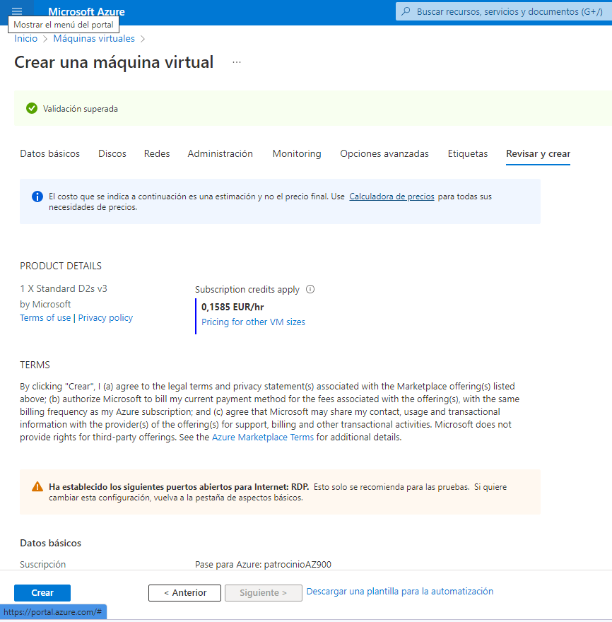
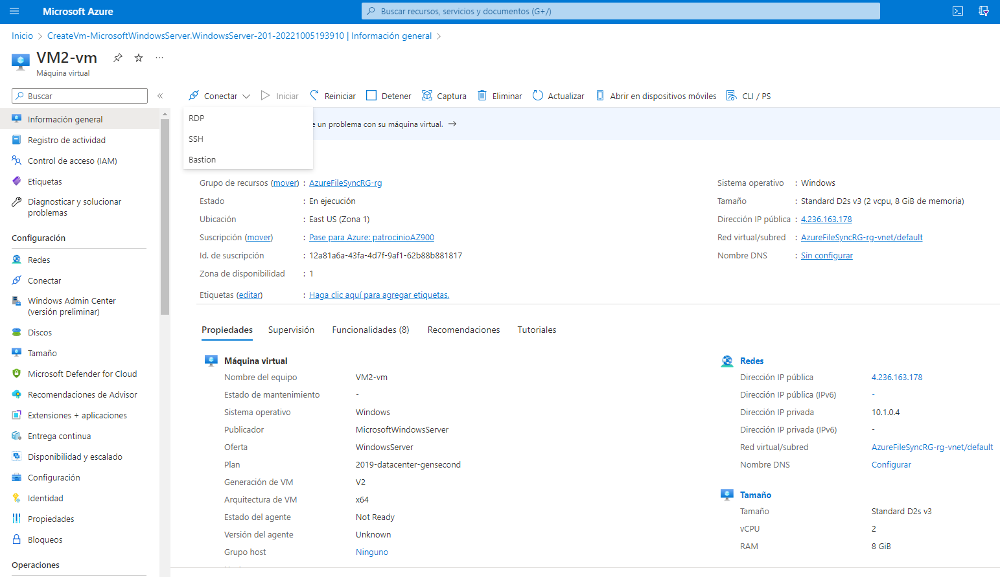
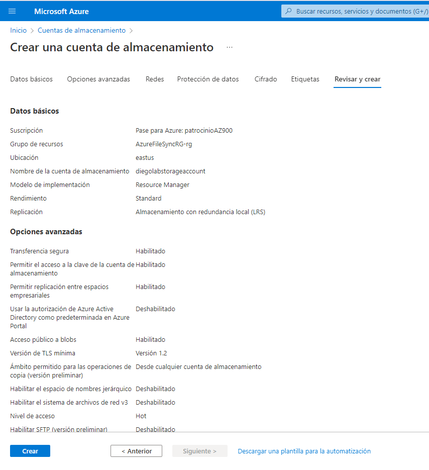
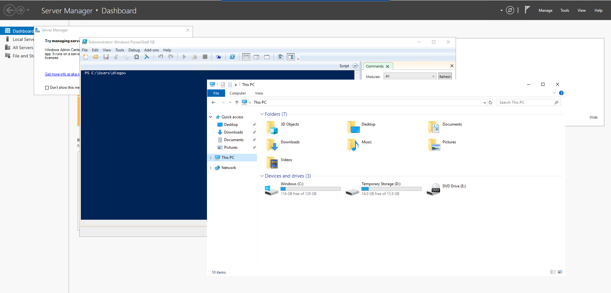
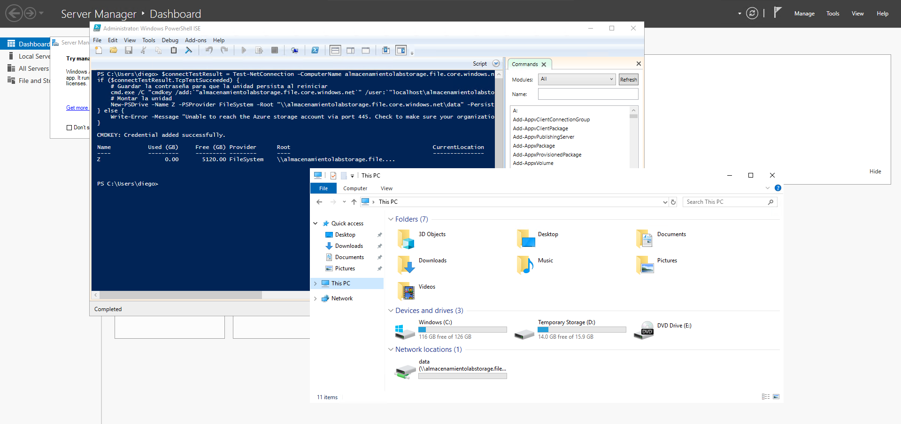
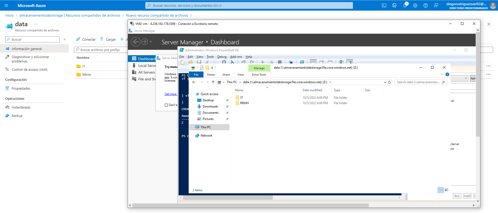

# Azure FileSync

### Máquina Virtual (VM)

Creamos el grupo de recursos AzureFileSyncRG-rg

Creamos la máquina virtual (VM2-vm) localizada en la región preferida y la montamos en Windows 2019. Establecemos un nombre de usuario del sistema y una contraseña de acceso. En la pestaña Monitoring desactivamos la opción 'Boot diagnostics'.




(Podemos generar una plantilla de creación de la máquina virtual para próximas ocasiones, que se adjunta al repositorio a modo de ejemplo.)
  
Desplegamos la VM mediante la descarga del archivo RDP y las credenciales de acceso recién creadas.



### Cuenta de almacenamiento

Creamos una cuenta de almacenamiento en el mismo grupo de recursos que hemos alojado la VM (AzureFileSyncRG-rg).

**IMPORTANTE:** el nombre de la cuenta debe ser único.



Una vez creada la cuenta de almacenamiento vamos a ella, y abrimos *'Recursos compartidos de archivos'*, en el menú *'Almacenamiento de datos'*, y creamos nuestro recurso compartido de datos, que en este caso hemos llamado *'data'*.



Una vez dentro del recurso hacemos clic en *conectar* y asignamos una letra a la unidad unidad. Es **importante** recordar que le daremos una letra del final del abecedario, ya que las primeras las asigna el sistema automáticamente. En este caso seleccionamos *Z*. Pedimos que nos muestre el script, que será algo así:


  ```

$connectTestResult = Test-NetConnection -ComputerName almacenamientolabstorage.file.core.windows.net -Port 445

if ($connectTestResult.TcpTestSucceeded) {

    # Guardar la contraseña para que la unidad persista al reiniciar

    cmd.exe /C "cmdkey /add:`"almacenamientolabstorage.file.core.windows.net`" /user:`"localhost\almacenamientolabstorage`" /pass:`"XXXXXXXXXXXX""

    # Montar la unidad

    New-PSDrive -Name Z -PSProvider FileSystem -Root "\\almacenamientolabstorage.file.core.windows.net\data" -Persist

} else {

    Write-Error -Message "Unable to reach the Azure storage account via port 445. Check to make sure your organization or ISP is not blocking port 445, or use Azure P2S VPN, Azure S2S VPN, or Express Route to tunnel SMB traffic over a different port."

}
```

Copiamos el script completo y lo pegamos y ejecutamos en la consola PowerShell de la VM.

Con esto conseguimos que en el explorador de archivos aparezca la *unidad Z: data*. A ella podremos subir, bajar, modificar archivos y directorios que estarán actualizados en Azure en tiempo real. También podemos subirlo a través de la cuenta de almacenamiento de Azure y estará actualizado en el momento en el sistema local.

En este ejemplo hemos creado dos carpetas: IT y RRHH a modo de ejemplo.

